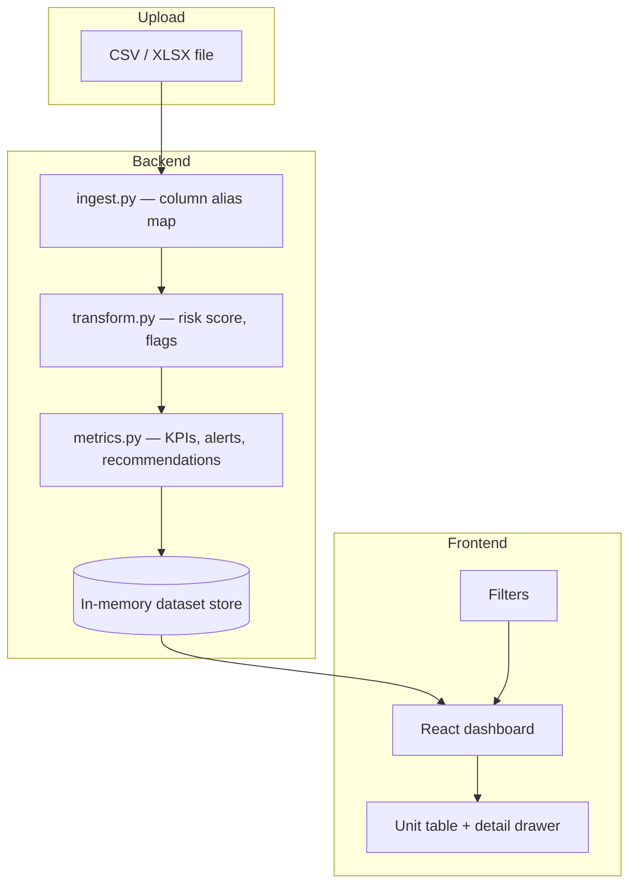

# Leasing Operations Dashboard

A lightweight internal dashboard that ingests property management exports (CSV/XLSX, including AppFolio-style files) and turns raw leasing data into operational KPIs, risk insights, and actionable recommendations.

This project is the **proof-of-concept application** follow-up to an earlier **Leasing Performance Data System** (Jupyter notebook + Excel + static charts). The analytics logic is reused; this repo adds upload, API, filters, and an interactive UI.

---

## Prerequisites

- **Python 3.11+**
- **Node.js 20+**
- No Docker required

---

## Quick start (recommended)

**Windows (PowerShell):**

```powershell
cd c:\dev\leasing-operations-dashboard
.\scripts\dev.ps1
```

**macOS / Linux:**

```bash
chmod +x scripts/dev.sh
./scripts/dev.sh
```

Then open:

- **App:** http://127.0.0.1:5173
- **API docs:** http://127.0.0.1:8000/docs

Use **AppFolio** or **Legacy** buttons to demo without uploading a file. Or upload `data/sample_appfolio_export.csv` via **Choose file**.

---

## Manual run (two terminals)

**Terminal 1 — API**

```powershell
cd backend
python -m venv .venv
.\.venv\Scripts\activate
pip install -r requirements.txt
uvicorn app.main:app --reload --host 127.0.0.1 --port 8000
```

**Terminal 2 — UI**

```powershell
cd frontend
npm install
npm run dev
```

---

## Tech stack

| Layer | Technology | Role |
|-------|------------|------|
| **API** | FastAPI, Pandas, openpyxl, Pydantic | Ingest, column mapping, risk/KPI logic |
| **UI** | React 19, TypeScript, Vite | Dashboard and interactions |
| **Styling** | Tailwind CSS v4 | Layout and components |
| **Data fetching** | TanStack Query | API cache and refetch on filter change |
| **Tables** | TanStack Table | Sortable unit grid |
| **Charts** | Recharts | Risk, DOM histogram, occupancy, funnel, workload |
| **Tests** | `unittest`, FastAPI TestClient, httpx | Backend pipeline and API |

---

## Project structure

```
leasing-operations-dashboard/
├── backend/
│   ├── app/
│   │   ├── api/routes.py      # REST endpoints
│   │   ├── ingest.py          # CSV/XLSX + column aliases
│   │   ├── transform.py       # Risk score, derived fields
│   │   ├── metrics.py         # KPIs, alerts, recommendations
│   │   ├── pipeline.py        # ingest → transform → metrics
│   │   └── main.py
│   ├── scripts/generate_sample_data.py
│   └── tests/
├── frontend/
│   └── src/
│       ├── api/                 # API client
│       ├── components/          # UI, charts, filters, drawer
│       └── context/             # Dataset + filter state
├── data/                        # Sample CSV exports
├── first task/                  # Prior take-home reference (notebook, Excel, PNG)
└── scripts/dev.ps1, dev.sh      # One-command local dev
```

---

## Data flow



1. User uploads a file or loads a bundled sample → `POST /upload` or `POST /samples/{name}`.
2. Backend maps columns (AppFolio or legacy names) to a canonical schema.
3. Each unit is enriched with risk score, vacancy flags, price variance, etc.
4. KPIs, charts, alerts, and recommendations are computed for the full or **filtered** dataset.
5. Frontend refetches dashboard and units when sidebar filters change.

---

## Features (POC requirements)

| Feature | Implementation |
|---------|----------------|
| **Upload CSV/XLSX** | Drag-and-drop or file picker |
| **AppFolio-style columns** | Automatic alias mapping (`Advertised Rent`, `Days Vacant`, `Property Manager`, …) |
| **Operational KPIs** | Occupancy, vacant/active units, conversions, risk counts, pricing, lease expirations |
| **Charts** | Risk (active only), DOM histogram + mean, status, occupancy by property, funnel, workload |
| **Filters** | Property, status, owner, risk category, date range |
| **Unit detail** | Click row → drawer with full record + recommendations |
| **Portfolio alerts & action plan** | Critical/warning banners + prioritized recommendations |

---

## Sample data

| File | Format |
|------|--------|
| `data/sample_appfolio_export.csv` | AppFolio-style headers |
| `data/sample_leasing_export.csv` | Legacy headers (matches first take-home notebook) |

Both are generated from the same logic (`seed=42`, 45 units, 3 properties). Regenerate:

```powershell
backend\.venv\Scripts\python.exe backend\scripts\generate_sample_data.py
```

---

## API overview

| Method | Path | Description |
|--------|------|-------------|
| `GET` | `/health` | Health check |
| `POST` | `/upload` | Upload CSV/XLSX |
| `POST` | `/samples/appfolio` | Load AppFolio demo |
| `POST` | `/samples/legacy` | Load legacy demo |
| `GET` | `/datasets/{id}/dashboard` | KPIs, charts data, alerts, recommendations (supports filter query params) |
| `GET` | `/datasets/{id}/units` | Filtered unit list |
| `GET` | `/datasets/{id}/units/{unit_key}` | Unit detail + recommendations |
| `GET` | `/datasets/{id}/filter-options` | Distinct filter values |

Interactive docs: http://127.0.0.1:8000/docs

---

## Testing

```powershell
cd backend
.\.venv\Scripts\activate
python -m unittest discover -s tests -v
```

```powershell
cd frontend
npm run build
```

---

## Assumptions

1. **Export formats vary** — AppFolio and other PM systems use different column names; the app maps common aliases and warns on unmapped or missing columns.
2. **One upload = one session** — Processed data is stored in memory (POC). Restarting the API clears uploads.
3. **Synthetic demo data** — Bundled CSVs are simulated, not live client data.
4. **Status semantics** — `Vacant-Unrented` / `Active for Lease` are treated as active for lease; `Occupied` / `Leased` as leased.
5. **Conversion KPIs** — Funnel totals and conversion **percentages** use **portfolio-wide** sums (all units), matching the first take-home notebook. Active-unit metrics (avg DOM, over/underpriced counts) use active units only.
6. **Risk chart** — Distribution includes **active for-lease units only** (Critical / At Risk / On Track), matching the original static dashboard PNG.
7. **Forecast** — “DOM forecast” is a **median-by-property baseline**, not a trained time-series model.

---

## Relationship to the first take-home

The folder `first task/` contains the original deliverables:

- `Leasing_Performance_System.ipynb` — data generation, KPIs, risk model, recommendations
- `Leasing_Performance_System.xlsx` — Excel export
- `Leasing_Dashboard.png` — static 2×2 matplotlib dashboard
- `read.md` — written analysis

**This POC reuses:**

- 45-unit / 3-property sample logic (`backend/scripts/generate_sample_data.py`, same `seed=42`)
- Risk scoring weights and categories (0–100 score; Critical / At Risk / On Track / Leased)
- Recommendation rules (pricing, marketing, follow-up, extended vacancy)
- Chart intent (risk, DOM histogram, occupancy, funnel)

**This POC adds:**

- File upload and AppFolio column mapping
- REST API + React UI with filters and unit drill-down
- Portfolio alerts and prioritized action plan
- No manual spreadsheet step for weekly exports

**Not replicated (by design):**

- Excel workbook download
- Jupyter narrative cells
- Exact pixel match to matplotlib PNG (Recharts + interactive layout)

---

## What I would improve at scale

| Area | POC today | Production direction |
|------|-----------|----------------------|
| **Storage** | In-memory | PostgreSQL or warehouse (BigQuery/Snowflake) + object storage for raw files |
| **Multi-tenant** | Single user | Client/property hierarchy, auth (OAuth), row-level security |
| **Ingest** | Manual upload | Scheduled AppFolio API / SFTP drops, dbt staging models |
| **Forecast** | Median DOM | Time-series model (Prophet/ARIMA) per property and unit type |
| **Alerts** | On page load | Slack/email when risk score crosses thresholds |
| **Exports** | — | PDF/Excel scheduled reports for leadership |
| **Deploy** | Local dev | Containerized API + static UI on CDN, CI running tests |

**Automation ideas (from first task, now feasible):**

- Weekly scheduled ingest with email summary of critical units
- Auto-ticket creation for units vacant 60+ days
- Pricing approval workflow when variance exceeds ±7%

---

## Troubleshooting

| Issue | Fix |
|-------|-----|
| `127.0.0.1:5173` does not load | Ensure `npm run dev` is running; check Vite bound to `127.0.0.1` in `frontend/vite.config.ts` |
| API unreachable in UI | Start backend on port 8000; UI proxies `/api` → `8000` |
| Port 5173 in use | Stop other Vite processes: `netstat -ano \| findstr :5173` then `taskkill /PID <id> /F` |
| Upload fails | Confirm file is `.csv`, `.xlsx`, or `.xls` and includes Property, Unit, Status columns |

---

## Author note (submission)

Built as a VirtuAll VA proof-of-concept by Vando Pereira: **clarity, practical ops value, and clean structure** over production complexity. For a walkthrough, load the **legacy sample**, review portfolio alerts, filter to one property, and open a **Critical** unit in the detail drawer.
